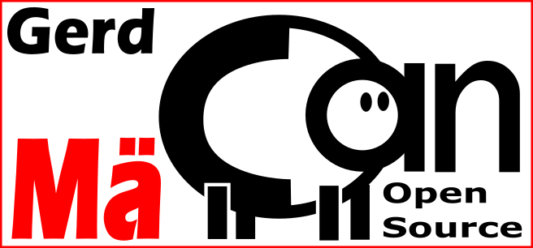

# M√ÒCAN-Project

 by [Gerhard Bertelsmann](mailto:info@gerhard-bertelsmann.de) 
Hier entsteht ein System zur digitalen Steuerung einer Modellbahn, das auf dem CAN-Bus-Protokoll von M√Òrklin basiert. Ziel ist es, eine preisg√¶nstige und frei zug√Òngliche L√sung zu schaffen.

